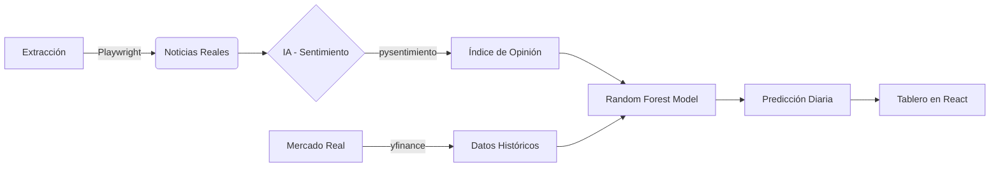

# FinSight Colombia 🇨🇴📊


### Inteligencia Artificial Aplicada al Mercado Financiero Colombiano

**FinSight Colombia** es un ecosistema avanzado que fusiona el procesamiento de lenguaje natural (NLP) con modelos de Machine Learning para predecir tendencias en los indicadores económicos más críticos del país: **TRM, Inflación y Tasas de Intervención.**

---

## 🚀 El Flujo de Inteligencia



1.  **🔍 Extracción Sigilosa:** Raspado de medios líderes (Portafolio, La República, etc.) usando tecnología *anti-detect*.
2.  **🧠 Análisis Cognitivo:** Evaluación del sentimiento financiero con modelos entrenados en español latinoamericano.
3.  **📈 Predicción de Tendencia:** Un bosque de 100 árboles de decisión vota la tendencia del mercado basándose en la correlación histórica entre noticias y realidad.
4.  **🖥️ Visualización Premium:** Interfaz reactiva para toma de decisiones con datos en tiempo real.

---

## 🛠️ Stack Tecnológico


---

## 📦 Estructura del Proyecto

```
FinSightColombia/
├── main.py                 # Punto de entrada FastAPI
├── setup.py               # Script inicial de configuración
├── requirements.txt       # Dependencias Python
├── .env                   # Variables de entorno
│
├── api/                   # Backend FastAPI
│   └── rutas/
│       ├── mercado.py     # Endpoints de datos de mercado
│       ├── prediccion.py  # Endpoints de predicciones
│       ├── noticias.py    # Endpoints de noticias
│       └── scraper.py     # Endpoints de scraping
│
├── extraccion/            # Motor de web scraping
│   ├── scraper_base.py    # Clase base con Playwright
│   ├── portafolio.py      # Scraper de Portafolio.co
│   ├── larepublica.py     # Scraper de LaRepublica.co
│   ├── eltiempo.py        # Scraper de ElTiempo.com
│   └── semana.py          # Scraper de Semana.com
│
├── db.py                  # Funciones CRUD de BD
├── modelo.py              # Modelos Random Forest
├── nlp.py                 # Análisis de sentimiento
├── market_data.py         # Descarga datos de yfinance
├── schema.sql             # Esquema de PostgreSQL
│
└── views/                 # Frontend React
    ├── package.json
    ├── vite.config.js
    ├── src/
    │   ├── App.jsx
    │   ├── main.jsx
    │   ├── App.css
    │   └── components/
    │       └── CardPrediccion.jsx
    └── public/
```

---

## ⚡ Quick Start

### 1. Requisitos Previos

- **Python 3.11+**
- **PostgreSQL 12+**
- **Node.js 18+**
- **Git**

### 2. Instalación del Backend

```bash
# Clonar repositorio
git clone https://github.com/usuario/FinSightColombia.git
cd FinSightColombia

# Crear entorno virtual
python -m venv venv

# Activar (Windows)
venv\Scripts\activate
# O (macOS/Linux)
source venv/bin/activate

# Instalar dependencias
pip install -r requirements.txt

# Instalar Playwright (para web scraping)
playwright install
```

### 3. Configuración Base de Datos

```bash
# Crear .env con credenciales PostgreSQL
cp .env.example .env

# Editar .env con tus credenciales
# DB_HOST=localhost
# DB_USER=postgres
# DB_PASSWORD=tu_password

# Ejecutar setup (crea BD, tablas, carga datos iniciales)
python setup.py
```

### 4. Iniciar Backend

```bash
# Terminal 1 - API FastAPI
python main.py

# La API estará en: http://localhost:8000
# Docs interactivo: http://localhost:8000/docs
```

### 5. Instalación del Frontend

```bash
# Terminal 2 - Frontend React
cd views
npm install
npm run dev

# El dashboard estará en: http://localhost:5173
```

---

## 📡 API Endpoints

### Mercado (Market Data)

```
GET /mercado/tendencia?variable=TRM
- Retorna la tendencia actual de una variable

GET /mercado/historico?variable=TRM&dias=30
- Retorna datos históricos

GET /mercado/estadisticas?variable=TRM&dias=90
- Retorna min/max/promedio/volatilidad
```

### Predicciones

```
GET /prediccion/hoy?variable=TRM
- Predicción para hoy con confianza

GET /prediccion/historico?variable=TRM&dias=30
- Histórico de predicciones vs realidad

GET /prediccion/resumen
- Resumen de todas las predicciones
```

### Noticias

```
GET /noticias/recientes?limite=20&tema=TRM
- Últimas noticias procesadas

GET /noticias/por-tema?tema=TRM&dias=7
- Noticias agrupadas por tema

GET /noticias/estadisticas?dias=30
- Estadísticas generales de noticias
```

---

## 🔄 Flujo de Datos

### Pipeline Diario

1. **7:00 AM** - Scraper extrae noticias de medios colombianos
2. **7:30 AM** - NLP analiza sentimiento y clasifica por tema
3. **8:00 AM** - yfinance descarga datos de mercado reales
4. **8:15 AM** - Modelo ML genera predicción basada en features
5. **8:30 AM** - Dashboard actualiza con nuevas predicciones
6. **6:00 PM** - Sistema compara predicción vs valor real

### Features para Modelo

```python
[
    cambio_promedio,        # Cambio promedio últimos 5 días
    volatilidad,            # Desviación estándar
    sentimiento_indice,     # Índice de sentimiento (-1 a 1)
    valor_actual,           # Valor actual de la variable
    cambio_total_5d         # Cambio total últimos 5 días
]
```

### Salida Modelo

```json
{
    "prediccion": "sube|baja|mantiene",
    "confianza": 75.5
}
```

---

## 📊 Machine Learning

### Modelo: Random Forest

- **Algoritmo:** 100 árboles de decisión
- **Max Depth:** 15
- **Clases:** 3 (Sube: 1, Mantiene: 0, Baja: -1)
- **Entrenamiento:** Datos últimos 6 meses
- **Validación:** Comparación histórica predicciones vs realidad

### Variables Predichas

- **TRM:** Tasa representativa del mercado (USD/COP)
- **Inflación:** Índice de precios al consumidor (IPC)
- **Tasas:** Tasa de intervención del BanRep

---

## 🔐 Seguridad

- Scraping con Playwright Stealth para evitar bloqueos
- User-agents aleatorios
- Delays entre requests (3-5 segundos)
- Credenciales en `.env` (nunca en código)

---

## 📈 Roadmap v2.0

- [ ] Scraper automático para más fuentes
- [ ] WebSockets para actualizaciones en tiempo real
- [ ] Notificaciones por email/SMS
- [ ] Exportación de reportes a PDF
- [ ] Dashboard administrativo
- [ ] Integration con APIs de corredores

---

## 🤝 Contribuciones

Las contribuciones son bienvenidas. Por favor:

1. Fork el proyecto
2. Crea una rama para tu feature (`git checkout -b feature/AmazingFeature`)
3. Commit cambios (`git commit -m 'Add AmazingFeature'`)
4. Push a la rama (`git push origin feature/AmazingFeature`)
5. Open Pull Request

---

## 📞 Soporte

Para reportar bugs o sugerir features, abre un issue en el repositorio.

---

## 📄 Licencia

Distribuido bajo licencia MIT. Ver `LICENSE` para más detalles.

---

**FinSight Colombia** © 2025 | Hecho con 🧠 y ❤️ para el mercado financiero colombiano

## 🛠️ Configuración Rápida

<details>
<summary><b>Ver pasos de instalación</b></summary>

1.  **Entorno:** `python -m venv venv` y activa con `venv\Scripts\activate`.
2.  **Dependencias:** `pip install -r requirements.txt`.
3.  **Base de Datos:** Crea `finsight_colombia` en Postgres y ejecuta `schema.sql`.
4.  **Frontend:** `cd views && npm install`.
</details>

---

*Desarrollado con enfoque en ingeniería de datos y análisis predictivo.*
