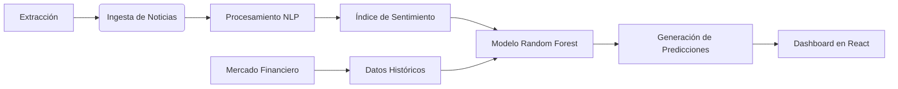

# FinSight Colombia

### Sistema de Análisis Predictivo para Indicadores Económicos

FinSight Colombia es una plataforma diseñada para la captura, procesamiento y análisis de datos financieros en el contexto colombiano. El sistema integra técnicas de procesamiento de lenguaje natural y modelos de aprendizaje supervisado para proyectar la tendencia de indicadores clave: TRM, Inflación y Tasas de Intervención.

---

## Arquitectura del Sistema

### Componentes Principales

1.  **Recolección de Datos:** Implementación de agentes de extracción automatizada basados en Playwright, configurados con protocolos de rotación de agentes y evasión de bloqueos.
2.  **Análisis de Sentimiento:** Motor de NLP basado en modelos transformadores (pysentimiento) optimizados para el dominio financiero en español.
3.  **Motor Predictivo:** Modelo de clasificación Random Forest que correlaciona el volumen y sentimiento de noticias con las variaciones históricas del mercado.
4.  **Visualización:** Interfaz de usuario reactiva para la presentación de indicadores, probabilidades de confianza y comparativos históricos.

---

## Especificaciones Técnicas

*   **Backend:** FastAPI (Python 3.11+)
*   **Frontend:** React + Vite
*   **Base de Datos:** PostgreSQL
*   **Machine Learning:** Scikit-learn
*   **NLP:** Pysentimiento (Transformers)
*   **Automatización:** Playwright

---

## Estructura del Proyecto

*   **api/**: Endpoints y servicios de la API REST.
*   **extraccion/**: Lógica de raspado y agentes de usuario.
*   **views/**: Aplicación frontend en React.
*   **modelos/**: Almacenamiento de modelos entrenados (.joblib).
*   **datos/**: Repositorio de datos estructurados y brutos.

---

## Despliegue Local

1.  **Entorno Virtual:** Configurar con `python -m venv venv` y activar.
2.  **Instalación:** Ejecutar `pip install -r requirements.txt`.
3.  **Base de Datos:** Ejecutar el script `schema.sql` en una instancia de PostgreSQL.
4.  **Frontend:** Acceder a la carpeta `views`, ejecutar `npm install` y `npm run dev`.

---

*Documentación técnica de FinSight Colombia.*
