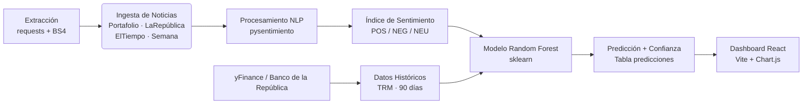

# FinSight Colombia

### Sistema de Análisis Predictivo para Indicadores Económicos

FinSight Colombia es una plataforma diseñada para la captura, procesamiento y análisis de datos financieros en el contexto colombiano. El sistema integra técnicas de procesamiento de lenguaje natural y modelos de aprendizaje supervisado para proyectar la tendencia de indicadores clave: TRM, Inflación y Tasas de Intervención.

---

## Arquitectura del Sistema



### Componentes Principales

1.  **Recolección de Datos:** Agentes de scraping síncronos basados en `requests` + `BeautifulSoup`, con rotación de User-Agent y manejo robusto de errores.
2.  **Análisis de Sentimiento:** Motor NLP basado en transformers (`pysentimiento`) optimizado para el dominio financiero en español. Clasifica cada noticia como `POS`, `NEG` o `NEU`.
3.  **Motor Predictivo:** Modelo de clasificación Random Forest que correlaciona el volumen y sentimiento de noticias con las variaciones históricas del mercado. Genera un score de confianza por predicción.
4.  **Visualización:** Dashboard en React con gráficas de TRM histórica + proyección, historial de sentimiento de mercado, y panel de noticias con filtros por fuente.

---

## Métricas del Dashboard

El dashboard muestra **dos métricas distintas** que no deben confundirse:

| Métrica | Origen | Significado |
|---|---|---|
| **Confianza del modelo (ej. 87%)** | Modelo Random Forest (BD) | Qué tan seguro está el modelo ML de su predicción de subida/bajada de TRM |
| **Sentimiento (ej. 75% negativo)** | Calculado en frontend | Proporción de noticias con sentimiento negativo sobre el total cargado |

---

## Modelos Predictivos y Aprendizaje Supervisado

El motor de predicción (`modelo.py`) combina un clasificador basado en Machine Learning junto con heurísticas financieras tradicionales:

*   **Algoritmo:** `RandomForestClassifier` (150 estimadores, profundidad máxima de 8).
*   **Características (Features) de Entrada:**
    1.  `puntaje_promedio`: Sentimiento promedio del día.
    2.  `puntaje_lag`: Sentimiento promedio del día anterior (captura el efecto memoria).
    3.  `volumen_norm`: Cantidad de noticias normalizada.
    4.  `retorno`: Variación porcentual diaria de la TRM.
*   **Entrenamiento:** Para entrenar o re-entrenar el modelo con los datos etiquetados disponibles en la base de datos, ejecuta:
    ```bash
    python modelo.py
    ```
    El modelo entrenado se exportará a `modelos/random_forest_trm.joblib`.

---

## Administración de Datos y Seeders

El sistema incluye scripts para inicializar y poblar la base de datos de forma sencilla:

*   **`setup_auth.py`**: Crea la tabla de usuarios e inserta el administrador inicial (`admin@finsight.com` / `admin123`).
*   **`seed_trm.py`**: Descarga la TRM real desde **datos.gov.co** (BanRep) para los últimos 90 días (o simula un Random Walk de contingencia si la API falla).
*   **`seed_historicas.py`**: Genera 120 titulares financieros históricos etiquetados para entrenar el modelo de Machine Learning.
*   **`seed_all.py`**: Limpia por completo la base de datos y monta el set de prueba inicial (noticias, histórico y predicciones mock).

---

## Especificaciones Técnicas

*   **Backend:** FastAPI (Python 3.11+) + Uvicorn
*   **Frontend:** React + Vite (Tailwind / Custom CSS)
*   **Base de Datos:** PostgreSQL
*   **Machine Learning:** Scikit-learn (Random Forest)
*   **NLP:** Pysentimiento (Transformers, HuggingFace)
*   **Scraping:** requests + BeautifulSoup4 + lxml
*   **Datos de Mercado:** yFinance + Banco de la República

---

## Estructura del Proyecto

```
FinSightColombia/
├── api/                  # Endpoints FastAPI (noticias, mercado, prediccion, scraper, auth)
│   └── rutas/
├── extraccion/           # Scrapers por fuente (portafolio.py, dinero.py, etc.)
├── views/                # Aplicación frontend en React (Vite)
│   └── src/
│       ├── components/   # DashboardPage, LoginPage, UserManagement, etc.
│       └── assets/
├── modelos/              # Modelos entrenados (.joblib)
├── migrations/           # Scripts de migración de BD
├── schema.sql            # Esquema completo de PostgreSQL
├── db.py                 # Capa de acceso a datos
├── nlp.py                # Pipeline de análisis de sentimiento
├── modelo.py             # Entrenamiento y predicción Random Forest
├── seed_historicas.py    # Carga inicial de datos históricos TRM
├── seed_trm.py           # Seed de TRM vía yFinance
├── seed_all.py           # Orquestador de todos los seeds
├── setup.py              # Setup inicial del sistema
├── setup_auth.py         # Creación de usuarios y roles
├── run.bat               # Script de arranque del backend
├── requirements.txt      # Dependencias del proyecto
└── .env                  # Variables de entorno locales
```

---

## Despliegue Local

### Pre-requisitos
- Python 3.11+
- Node.js 18+
- PostgreSQL 15+

### Backend

```bash
# 1. Crear y activar el entorno virtual
python -m venv .venv
.\.venv\Scripts\activate

# 2. Instalar dependencias
pip install -r requirements.txt

# 3. Configurar variables de entorno
# Copiar .env.example a .env y completar con tus credenciales
copy .env.example .env

# 4. Inicializar la base de datos
psql -U postgres -f schema.sql

# 5. Configurar tablas y usuario admin inicial
python setup_auth.py

# 6. Poblar datos históricos de la TRM y noticias
python seed_trm.py
python seed_historicas.py

# 7. Entrenar el modelo
python modelo.py

# 8. Arrancar el backend
.\run.bat
# o bien: uvicorn main:app --reload
```

### Frontend

```bash
cd views
npm install
npm run dev
```

El dashboard estará disponible en `http://localhost:5173` y la API en `http://localhost:8000`.

---

## Variables de Entorno (`.env`)

El archivo `.env` debe configurarse en la raíz del proyecto con la siguiente estructura:

```env
DB_HOST=localhost
DB_PORT=5432
DB_NAME=finsight
DB_USER=postgres
DB_PASSWORD=tu_contraseña
SECRET_KEY=tu_clave_jwt_secreta
```

---

*FinSight Colombia — Sistema de análisis predictivo de indicadores económicos colombianos.*
